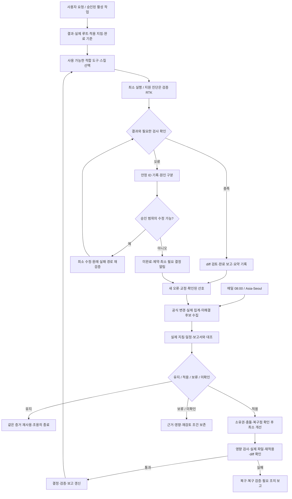
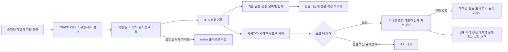

# Codex 글로벌 작업·개선 루틴 공유 안내

기준일: **2026-10-08** · 대상: 로컬 Codex를 사용하는 PC

사용자 요청을 정확히 끝내면서 불필요한 탐색·출력·재시도를 줄이는 운영 절차다.
작업 중 관찰한 오류와 확인된 선호를 기록하고, 공식 변경과 대조해 필요한 개선을 검증까지 완료한다.
OpenAI의 기능을 기반으로 구성한 개인 TRACE 운영 정책이며, OpenAI가 배포한 공식 셋업은 아니다.

> **배포 범위:** 이 문서와 최신 RTK 호출 정책·프로젝트 도구 라우팅·회고 규칙은
> `codex/global-setup-handoff-20261008` 브랜치의 검토 대상이다. 현재 호스트는 로컬 적용·검증했다.
> 브랜치/PR 게시와 main 병합·태그 릴리스는 별개이며, v1.2.4에는 이번 추가 변경이 포함되지 않는다.
> 이 문서는 공유용 설명이며 다른 PC의 자동화 등록이나 실행 권한을 부여하지 않는다.

## 1. 전체 FLOW



작업이 끝나면 종료한다. 다음 작업이나 예약 점검에서 기록을 재사용하는 연결이며,
상시 실행되는 무한 루프·새 이벤트 리스너를 설치한다는 뜻은 아니다.
아래 RTK 실시간 화면은 사용자가 따로 시작하는 로컬 집계 조회 기능이다.
업무 자동 실행·프로젝트 감시·모델 호출과 구분한다.

## 2. 작업할 때의 기본 절차

1. **요청 파악:** 의도·명시 제약·허용 범위·최소 완료 기준을 정한다.
2. **프로젝트 확인:** 실제 작업 루트와 글로벌/프로젝트 지침, override, 관련 런타임 핀을 확인한다.
3. **도구 선택:** 목적에 맞는 기존 도구·커넥터·스킬을 사용한다. 모든 도구를 시험하거나 호출 수를 늘리지 않는다.
4. **최소 실행:** 관련 파일만 조사·수정하고 독립 조회는 제한된 출력으로 묶는다.
5. **오류 대응:** 관찰한 오류는 즉시 기록·진단하고 승인된 수정은 현재 작업에서 끝낸다.
6. **완료 검증:** 원래 실패 경로와 영향받은 기존 검사를 확인하고 diff를 검토한다.
7. **결과 기록:** 실제 통과 범위와 남은 제약을 보고한다. 검증되지 않은 프로젝트까지 성공으로 표시하지 않는다.

프로젝트별 규칙은 프로젝트에 둔다. 글로벌 선호로 프로젝트의 의존성·규칙을 일괄 교체하지 않는다.
Projects나 문서 폴더에서 작업한다는 선호는 형제 폴더 전체 조사·등록·수정 승인이 아니다.

## 3. 도구별 역할

| 구성 | 사용할 때 | 적용·검증 경계 |
|---|---|---|
| 글로벌 AGENTS.md | 작업의 기본 기대와 선호 | 프로젝트 override와 실제 세션 로딩을 함께 확인 |
| 조건부 가이드 | 해당 절차가 필요한 작업 | 모든 가이드를 매번 읽지 않음 |
| 커넥터·전용 도구 | 외부 자료·앱 작업에 적합할 때 | 실제 접근과 실행 가능 여부 확인 |
| TRACE RTK 러너 | 필요한 지원 진단을 실행할 때마다 | 소유권·해시·종료 코드·필요 증거 보존 |
| Ponytail | 사용자가 명시 요청한 작업 | 기존 코드·도구·표준 기능부터 판단하고 최소 구현 |
| Archify | 사용자가 명시 요청한 작업 | 실제 소스·계약 기반 FLOW; 도식은 실행 증거가 아님 |
| Computer Use | 실제 화면 조작·UI 검증이 필요할 때 | 공식 도구로 대상·동작·결과 확인; 파일 검사와 분리 |
| 서브에이전트 | 현재 호스트와 지침이 허용하고 독립 업무가 정당화될 때 | 직접 처리 기본, 겹치는 쓰기·불필요한 위임 방지 |

RTK user config의 호스트별 exclude_commands/suppress_hook_warning 선택은 설치 manifest 대상이 아니다.
이 브랜치 설치만으로 기존 훅이나 그 설정을 자동 복제하지 않는다.
필요하면 현재 설정·바이너리 호환성·공식 신뢰 절차를 별도로 검토한다.

### RTK 압축 경로

`지원 진단 → 검증 러너 → 소유권·바이너리 해시 확인 → 지원 필터 → 축약 출력·종료 코드 → 로컬 집계 → 일별 보고`

- Python/PowerShell 내부 진단도 러너를 직접 호출한다. 기본 훅의 재귀 인식을 가정하지 않는다.
- 정확한 파일 원문, 구조화 데이터, 변경 명령과 최종 완료 검사는 native로 유지한다.
- 이미 감싼 명령은 다시 감싸지 않는다. 미지원 명령은 승인된 native 경로로 처리한다.
- 짧은 출력의 절감 0은 정상일 수 있다. 절감 수치를 높이려고 명령을 추가하지 않는다.
- 기존 훅과 TRACE 러너의 바이너리·설정·검증 증거는 구분한다. 훅의 신뢰 해시나 실행 권한을 우회하지 않는다.
- RTK 추정 토큰·출력 바이트·실제 OpenAI 사용량은 별개다. 달러·구독 잔량·작업 시간으로 환산하지 않는다.

### 압축·일일 기록·실시간 화면의 연결



실시간 조회는 `gain --daily --format json`만 읽으며 압축 실행 수를 늘리는
검사 명령을 만들지 않는다. 저장 정본·일일 JSON/HTML도 덮어쓰지 않는다.
같은 날짜의 일일 수집은 기존 스냅샷을 교체하고 중복 합산하지 않는다.
실시간 화면과 파일 HTML은 서로 다른 접속 방식이며 파일은 저장 스냅샷이다.

현재 호스트는 실시간 서버를 로컬에서 시작하고 데이터 연결·자동 갱신 기능을
검사했다. 집계 날짜/시간대 한계와 산술 차이의 미확인 원인은 유지한다.
브라우저 렌더링 검증 및 다른 실제 PC의 실행은 별도다.
[실행·중지·재시작·보안 경계](rtk-live-dashboard.md)를 따른다.

## 4. 매일 오전 8시 개선 루틴

현재 호스트는 **매일 08:00 Asia/Seoul**에 기존 자동화를 실행한다.
다른 PC는 그 PC의 소유자 승인과 실제 일정에 맞춰 별도로 등록·확인한다.
로컬 파일을 사용하는 실행에는 PC와 앱이 사용 가능해야 한다.

| 단계 | 수행 | 완료 기준 |
|---|---|---|
| 수집 | 공식 Codex 문서·안정 CLI/RTK 릴리스·관련 공식 글, 실제 일별 집계, 새 오류·교정, 남은 후보 확인 | 수집 시각·접근 실패·미수집 구분 |
| 본문 검토 | 신규·수정·미검토 관련 원문과 현재 제품 문서 확인 | 인덱스·제목만으로 적용 결정하지 않음 |
| 회고 | 확인된 선호와 지침·실제 일정·보고서 대조 | 모순·오래된 권고·필수 도구 누락·완료 과장 분류 |
| 결정 | 유지·적용·보류·미확인 | 근거·영향·최소 검사·재검토 조건 기록 |
| 개선 | 허용된 작은 호환 수정만 소유권·충돌·복구점 확인 후 적용 | 기존 모델·effort·인증·권한·훅·프로젝트 규칙 보존 |
| 검증 | 영향받은 검사·실제 설치 파일·재적용·diff 확인 | 실패하면 복구와 복구 검사; 실패 상태 숨기지 않음 |
| 보고·종료 | 현재 집계·결정·완료 단계 갱신 | 의미 있는 검증 완료·새 실패·필요 결정만 알림 |

변경된 근거만 다시 검토한다. 같은 콘텐츠·적용성·도구 식별자의 성공 증거는 재사용한다.
바꿀 이유가 없는 날은 유지하며, 매일 규칙을 추가하거나 같은 버전을 재설치하지 않는다.
현재 작업의 차단 오류를 다음 예약 점검까지 미루지 않는다.

### 종료와 예외

- **변경 없음:** 미검토·보류 건 확인 후 기존 증거 재사용, 실제 집계 갱신, 조용히 종료.
- **승인 밖·충돌·정책 차단:** 적용 보류, 정확한 영향과 필요한 최소 조치 기록.
- **검사 실패·결과 불명확:** 실제 상태 확인, 허용된 수정·복구, 원래 경로 재검증.
- **복구 실패:** 미완료로 남기고 필요한 조치를 보고. 같은 실패를 근거 없이 반복하지 않음.
- **완료:** 검토·로컬 적용·검증·커밋·브랜치 게시·공개 릴리스를 각각 구분.

## 5. 오류·교훈 기록

기존 CODEX_HOME-aware TRACE 상태 위치의 **단일 private routine-review.json**을 사용한다.
별도 기억 저장소나 모든 대화 수집기를 만들지 않는다.

기록할 것: 안정 ID, 정제된 오류 서명, 발생 단계, 도구 식별자, 첫/최근 확인 시각,
확인된 원인과 가설 구분, 영향, 제한된 복구 결과, 원래 경로 검증, 다음 조치·재검토 조건.

기록하지 않을 것: 원문 프롬프트·대화·명령 이력·diff·인증·비밀·고객 자료·원시 화면.
동일 오류는 같은 ID에 병합한다. 공통 원인이 확인된 교훈만 글로벌로 반영하고 프로젝트 특수 규칙은 프로젝트에 남긴다.

오늘 확인한 대표 교훈:

| 관찰 | 반영한 원칙 |
|---|---|
| 중첩 명령은 기본 RTK 훅이 인식하지 못할 수 있음 | 지원 진단마다 명시 검증 러너 사용 |
| 보고서의 이전 스냅샷이 현재 실행 상태처럼 보임 | 수집 시각·실제 집계·실행 증거 분리 |
| 작은 출력의 압축 이점이 없을 수 있음 | 절감 0 허용, 수치용 추가 호출 금지 |
| UI 초기화 증상은 해소됐지만 원인은 미확인 | 해소 증거와 원인 confidence 분리 |
| 로컬 파일 URL이 브라우저 정책으로 차단됨 | 우회하지 않고 해당 화면은 미검증 유지 |
| 문서·설치·실행·원격 게시 상태가 서로 다름 | 단계별 완료와 미게시 변경을 명확히 표시 |

이는 근거 기반 운영 개선이다. 모델 자체의 재학습·자아·모든 프로젝트의 무오류 실행을 보장하지 않는다.

## 6. 다른 PC에 전달·적용하기

저장소: <https://github.com/DevCrop/codex-setup>

공개 인수인계 브랜치: `codex/global-setup-handoff-20261008`

- [다른 Windows PC 상세 설치 안내](https://github.com/DevCrop/codex-setup/blob/codex/global-setup-handoff-20261008/docs/install-another-windows-pc.md)
- [인수인계와 검증 범위](https://github.com/DevCrop/codex-setup/blob/codex/global-setup-handoff-20261008/docs/setup-handoff-20261008.md)
- [운영 계약](https://github.com/DevCrop/codex-setup/blob/codex/global-setup-handoff-20261008/docs/operations.md)

**검토한 브랜치의 실제 커밋과 PR 검사 결과를 먼저 확인한다.**
이 문서가 포함된 최신 커밋의 규칙을 plan/apply/verify로 적용한다.
기존 v1.2.4 태그나 이전 커밋은 오늘의 추가 정책과 다를 수 있다.
원래 PC의 Codex 홈 전체·개인 상태·집계·인증·대화·백업은 복사하지 않는다.

### 설치 기본 요건과 검사

Python 3.11 이상과 Git가 필요하다. Node.js는 Archify 렌더링 또는 선택한 CLI 설치 방식에 필요하다.
TRACE 설치 스크립트는 Python 표준 라이브러리를 사용한다.
프로젝트 의존성은 해당 프로젝트의 README·package.json·lockfile에 맞춰 별도로 설치한다.
Projects 같은 작업 폴더가 없으면 새 PC에서 선택한 위치에 생성하되 가짜 프로젝트 설정은 만들지 않는다.

검토한 체크아웃에서 PowerShell로 단계별 실행한다.

```powershell
$env:PYTHONIOENCODING = 'utf-8'
python -B scripts/setup.py plan
# 충돌·변경 범위를 확인한 다음 적용
python -B scripts/setup.py apply
python -B scripts/setup.py verify
python -B scripts/setup.py apply
# 두 번째 apply는 unchanged가 기대 결과
```

RTK가 필요하면 설치 자산·소유권을 검토한 후 실행한다.

```powershell
python -B scripts/tools.py install-rtk
python -B scripts/tools.py verify
python -B scripts/tools.py run git status
```

다른 프로젝트에서는 그 프로젝트의 작업 디렉터리를 유지하고,
CODEX_HOME 또는 기본 Codex 홈의 `bin/trace_rtk.py`를 절대경로로 호출한다.
별도 `--state`로 설치한 경우는 저장소가 안내하는 명시 state 실행 방식을 따른다.

예약 점검의 공통 검사 명령:

```powershell
python -B scripts/check_updates.py
python -B scripts/setup.py verify
python -B scripts/tools.py verify
python -B scripts/project_cleanup.py scan
python -B scripts/check_closure.py
```

이는 체크아웃·등록된 범위의 점검이며 전체 드라이브 조사나 의존성 삭제 명령이 아니다.
현재 호스트의 별도 node_modules 주간 정리는 7일 미작업 기준·보호 목록을 유지한다.
공유 저장소의 선택적 45일 정책으로 덮어쓰거나 다른 PC에 삭제 승인을 자동 이전하지 않는다.

### 새 PC 완료 체크리스트

- [ ] 검토한 소스의 브랜치·커밋과 최신 문서의 일치 확인
- [ ] plan 충돌 해결, verify 통과, 재적용 unchanged
- [ ] 본인 계정 로그인과 기존 모델·effort·MCP·권한·훅 보존
- [ ] 새 세션에서 실제 글로벌·프로젝트 지침 로딩 확인
- [ ] 필요한 RTK 진단의 종료 코드·필요 증거 확인
- [ ] 필요한 스킬·연결·UI 경로의 실제 실행 확인
- [ ] 소유자 승인 아래 자동화의 호스트·일정·알림·범위 별도 등록 또는 갱신
- [ ] 미확인·실패·게시 상태를 구분해 기록

## 7. 기존 자동화에 넣을 간결한 운영 요청

아래는 새 PC 소유자가 범위를 정해 전달할 수 있는 요약이다.
기존 전체 운영 계약을 무조건 대체하거나 자동 승인 기록을 생성하는 용도가 아니다.

> 검토한 TRACE 체크아웃과 적용 지침을 기준으로 기존 글로벌 유지관리 루틴을 운영한다.
> 확인된 사용자 선호, 승인된 활성 작업의 새 오류·교정, 관련 공식 원문 변경, 남은 후보를 실제 설치·일정·보고서와 대조한다.
> 유지·적용·보류·미확인을 근거와 함께 결정하고, 소유자가 승인한 호환 범위의 필요한 개선만 복구점·충돌 검토·검증 후 적용한다.
> 지원 진단마다 검증 RTK 러너를 사용하되 원문·JSON·변경·최종 검증은 native로 유지한다.
> 작업 중 승인된 차단 오류는 즉시 처리하고 원래 실패 경로를 확인한다.
> 같은 증거는 재사용하며 불필요한 변경·재설치·전체 조사·새 권한·원격 게시를 하지 않는다.
> 기존 단일 비공개 기록과 보고 계약을 유지하고 실제 완료·새 실패·필요 결정만 알린다.
> 모델·effort·인증·훅·프로젝트 규칙·별도 정리 정책을 보존한다.
> PC와 앱 가용성을 전제로 실제 수행한 결과만 기록하며 다른 프로젝트의 성공을 추정하지 않는다.

RTK 실시간 화면을 별도로 승인한 호스트는 일일 보고 생성 때 live UI 계약을
보존한다. 화면은 집계 시각과 `probe.checked_at`을 분리하고 오류를 성공으로
바꾸지 않는다. 기존 점검 일정·알림을 바꾸거나 서버 자동 시작·훅·권한·다른 PC
설치·원격 게시를 추가하는 승인은 이 보고 기능에 포함되지 않는다.

## 공식 근거와 개인 정책 구분

- [OpenAI AGENTS.md 안내](https://learn.chatgpt.com/docs/agent-configuration/agents-md): 글로벌·프로젝트 지침 계층.
- [OpenAI Skills 안내](https://learn.chatgpt.com/docs/build-skills): 목적이 분명한 스킬과 호출 방식.
- [OpenAI Best practices](https://learn.chatgpt.com/guides/best-practices): 적합한 도구·반복 절차·회고와 유지관리.
- [OpenAI Scheduled tasks](https://learn.chatgpt.com/docs/automations): 예약 작업과 로컬 실행 조건.
- [RTK 공식 저장소](https://github.com/rtk-ai/rtk): 제3자 출력 필터의 기능과 제한.

08:00 일정, 매 지원 진단의 RTK 사용, 기록 구조와 알림 방식은 사용자 선택·TRACE 정책이다.
공식 글이나 스킬이 플랫폼 실행 권한을 추가하거나 승인 차단을 해제하지 않는다.
