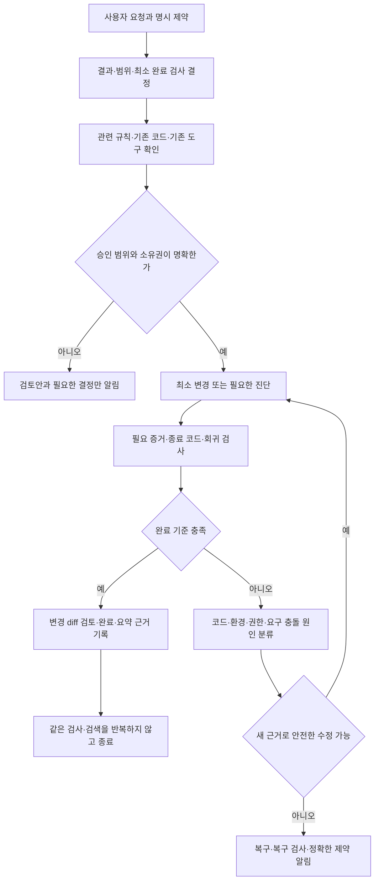

# 다른 PC에서 검증하는 TRACE 셋업·루틴

이 문서는 검토한 `codex/portable-adaptive-routine` 변경을 통합한 v1.2.4의
설치·운영 계약이다. 다른 PC에서는 릴리스 태그와 실제 관리 파일을 함께 확인한다.
수집·검토·적용·검증·공개 배포는 각각 기록하며, 아래 절차가 미래 실행을 보장하지 않는다.

## 1. 무엇이 전달되는가

| 구성 | 저장소가 제공하는 것 | 다른 PC에서 별도로 확인할 것 |
|---|---|---|
| 글로벌 작업 규칙 | 간결한 `AGENTS.md`, 필요한 작업에만 읽는 조건부 가이드 | 프로젝트 규칙과 사용자 변경의 충돌, 새 세션의 실제 로딩 |
| 설치·복구 | 소유권 기반 plan/apply/verify/rollback, 단일 이전 복구점 | Python 3.11+, Git, 각 PC의 독립된 설치 경로 |
| 모델·추론 | 선택을 보존하는 설정 병합, 선택 가능한 CLI 프로필 | 계정에서 모델 지원 여부, 사용자가 선택한 모델·effort |
| Ponytail·Archify | 해시로 고정한 원본 패키지, 명시 호출 정책 | 요청한 작업에서 실제 호출·동작, Archify 렌더링용 Node.js |
| RTK | 공식 제3자 안정 자산의 고정 해시, 명시적 검증 러너 | 플랫폼별 바이너리 설치, 실행 종료 코드·필요 증거 보존 |
| 유지보수 | 검토 가능한 공통 루틴 템플릿, 공식 근거 목록 | 기존 자동화 ID·호스트 승인·일정·알림 정책 |
| 피드백 | 요약 근거 → 원인 분류 → 최소 변경 → 검증 절차 | 승인된 작업에서 얻은 이 PC의 요약 기록 |
| 보고서 | 추정치·출력 바이트·실제 사용량을 분리하는 보고 계약 | 호스트의 실제 집계와 승인된 로컬 보고 UI |

인증, 세션·대화 기록, 사용자 원시 프롬프트, RTK 원시 명령 이력, 실제 집계,
프로젝트 경로·보호 목록, `routine-review.json`, 설치 영수증, 백업은 복제하지 않는다.
이 PC의 HTML/차트는 실제 호스트 데이터가 들어간 개인 결과물이다. 공유 정책의
근거로 쓰거나 다른 PC에 같은 수치를 채워 넣지 않는다. 옵션 보고 UI가 없는 새 PC는
집계·필터 검증 결과를 먼저 확인하며, UI 갱신을 성공했다고 기록하지 않는다.

## 2. 다른 PC에서 시작하기

```text
git clone --branch v1.2.4 https://github.com/DevCrop/codex-setup.git
cd codex-setup
git rev-parse HEAD
python --version
python -B -m unittest discover -s scripts -p 'test_*.py' -v
python -B scripts/validate_repo.py
```

Windows에서는 Python 출력이 깨지면 먼저 PowerShell에서 실행한다.

```powershell
$env:PYTHONIOENCODING = 'utf-8'
```

테스트는 임시 경로에서만 설치·삭제·복구한다. 실제 Codex 홈에 테스트 삭제를 하지 않는다.
심볼릭 링크 생성 권한이 없는 환경의 링크 생성 검사는 skip으로 표시될 수 있다.
skip은 통과한 실험이 아니므로 결과에 함께 남긴다.

### 실제 설치

```text
python -B scripts/setup.py plan
python -B scripts/setup.py apply
python -B scripts/setup.py verify
```

`plan`에 conflict가 있으면 내용을 먼저 검토한다. 기존 관리 파일의 사용자 수정은
`--adopt-existing`으로도 덮어쓰지 않는다. 최초의 비관리 개인 규칙을 가져올 때만
`plan --adopt-existing`을 검토한 후 승인된 `apply --adopt-existing`을 쓴다.

| 경로 | 기본값·선택 방식 | 주의점 |
|---|---|---|
| Codex 홈 | `CODEX_HOME`, 없으면 사용자 홈의 `.codex`; `--home`으로 지정 가능 | 인증·모델·MCP·권한·사용자 설정을 보존 |
| 개인 스킬 | 사용자 홈의 `.agents/skills`; `--personal-skills` | `CODEX_HOME` 변경만으로 이동하지 않음 |
| 설치 상태 | 해당 Codex 홈에 대응하는 사용자별 비공개 상태; `--state` | 서로 다른 PC/홈의 상태를 복사하지 않음 |
| 체크아웃 | 복제한 경로 | 드라이브 문자나 현재 작업 디렉터리를 고정하지 않음 |

격리 검증 시 `--home`, `--personal-skills`, `--state` **세 경로를 모두** 임시 위치로
지정하고 전체 수명주기에서 동일하게 사용한다. 겹치는 경로는 허용하지 않는다.
Codex 인증은 각 PC에서 지원되는 ChatGPT 로그인 절차로 수행한다.

### 설치 후 최소 완료 기준

1. `verify`의 관리 파일·설정·스킬 무결성 검사가 통과한다.
2. `apply`를 다시 실행하면 `unchanged`이며 기존 복구점이 유지된다.
3. 새 세션에서 글로벌 규칙과 해당 프로젝트 규칙의 로딩을 확인한다.
4. 모델·effort, 인증, MCP, 권한, 기존 훅과 사용자 소스가 보존된다.
5. 파일 검사만으로 스킬 호출·모델 준수를 입증했다고 표시하지 않는다.

필요하면 `python -B scripts/setup.py doctor --codex EXECUTABLE_PATH`로
설치 CLI와 다른 개인 스킬을 확인한다. 미관리 스킬이나 `SKILL.md` 없는 디렉터리는
검토 후보이며 삭제 승인이 아니다. 새 세션의 문맥은 다른 PC의 개인·프로젝트 규칙에
따라 달라질 수 있다.

## 3. 작업 흐름과 종료 조건



작은 작업은 직접 처리한다. 독립 조회는 필요한 출력만 묶고, 변경 없는 검증은
재사용한다. 실패를 같은 방법으로 반복하거나 새 근거 없이 검사 범위를 늘리지 않는다.
배포·원격 게시 등 추가 권한이 필요한 경우에는 검토 가능한 결과를 먼저 준비한다.

## 4. 등록된 일정과 작업 중 대응

다음 빈도는 TRACE의 운영 선택이다. OpenAI나 RTK가 모든 사용자에게 정한 주기가 아니다.
현재 확인한 TRACE 호스트는 월요일 10:00 Asia/Seoul 주간 루틴을 유지한다.
다른 호스트의 일별 설정을 복사해 이 일정을 바꾸지 않는다. 새 PC에 일정을 생성하거나
모니터 소유권을 이전하지 않는다. 켜져 있지 않은 PC의 실행을 보장하지 않는다.

| 시점 | 수행 | 다시 하지 않는 조건 |
|---|---|---|
| 기존 예약 루틴 | 공식 원문·안정 릴리스 수집, 미검토 backlog, 설치·도구·완료 상태 확인 | 본문·적용성이 동일한 검토는 재사용 |
| 새로운 안정 버전 | 관련 변경·호환성·소유권·호스트 승인을 확인한 후 설치·영향 검사 | 같은 버전을 매일 재설치하지 않음 |
| RTK 명시 실행 | 로컬 소유권·SHA-256 검증 후 지원 필터 실행 | 실행마다 네트워크 릴리스 조회를 하지 않음 |
| 변경 후 압축 검사 | 도구·필터 또는 관련 오류가 바뀐 범위의 읽기 전용 비교 | 같은 실행 환경의 검증 근거는 재사용 |
| 활성 작업의 오류·정정 | 원인 진단 후 승인된 차단 문제를 바로 수정 | 다음 날까지 미루거나 전체 프로젝트를 재조사하지 않음 |
| 도구·필터 변경 또는 새 실패 | 바뀐 범위의 기존 검사 | 변경 없는 전체 실험 반복 없음 |
| 실제 집계 수집 | 같은 날짜 스냅샷 교체, 승인된 로컬 차트 갱신 | 중복 합산·누락일의 가짜 0 없음 |
| 보고 | 검증된 변화·실패·필요한 사용자 조치 | 정상·불변·이미 보고한 보류 건은 조용히 종료 |

### 공통 실행 계약

```text
python -B scripts/check_updates.py
python -B scripts/setup.py verify
python -B scripts/tools.py verify
python -B scripts/tools.py plan-rtk-update
python -B scripts/project_cleanup.py scan
python -B scripts/check_closure.py
```

수집 성공, 본문 검토, 로컬 적용, 실제 검증, 커밋, 브랜치 게시, PR, 공개 릴리스는
별개 상태다. 새 PC의 비어 있는 도구·프로젝트·릴리스 영수증 상태는 미설치·미등록·미확인으로
해석하며 정상이라고 만들지 않는다. 등록된 프로젝트가 없으면 범위는 비어 있다.
드라이브 검색·자동 프로젝트 등록은 하지 않는다. 의존성 삭제는 실제 호스트와
자동화 ID가 일치하는 별도 `dependency_cleanup` 승인 기록이 있을 때만 렌더링한다.
이 PC의 기존 승인은 등록 프로젝트 45일 관찰과 실제 알림 후 7일 유예를 유지한다.
기록이 없으면 삭제 금지이며 다른 호스트의 정리 일정·보호 목록은 그대로 둔다.

### 기존 자동화용 프롬프트

```text
python -B scripts/render_heartbeat.py --automation-id EXISTING_ID
```

호환 기본값은 `trace`다. `codex`라는 기존 자동화라면 `--automation-id codex`를 쓴다.
로컬 `maintenance_authorization`의 mode, 승인일, 실제 호스트, 자동화 ID가 모두
일치해야 제한된 승인 범위를 표시한다. 다른 호스트·ID, 누락된 기록은 **review-only**다.
일치하는 문자열을 복사해 권한을 만들지 않는다. 승인 기록은 실제 사람의 승인을
기록하는 증거이며 보안 토큰이 아니다. 렌더러는 스케줄러나 플랫폼 승인 기능을
변경하지 않는다. 실제 앱 도구를 통해 기존 자동화에만 검토한 프롬프트를 반영한다.

## 5. RTK 사용과 업데이트

```text
필요한 진단 명령
  → TRACE 러너의 로컬 소유권·바이너리 해시 검사
  → RTK가 지원하는 필터
  → 축약 출력 + 원래 의미의 종료 코드
  → 로컬 RTK 기록
  → 날짜별 집계·근거 검사
  → 승인된 로컬 보고
```

별도 승인된 RTK 설치를 원하면 `python -B scripts/tools.py install-rtk` 후
`python -B scripts/tools.py verify`로 검증한다. 설치는 고정된 플랫폼 자산의
SHA-256·버전을 검사하며 기존 수정본은 충돌한다. instruction 설치만으로 바이너리가
자동 설치되거나 셸·PATH·훅이 바뀌지 않는다.

| 예시 명령 | 용도 | 확인할 제한 |
|---|---|---|
| `python -B scripts/tools.py plan-rtk-update` | 현재 수집한 안정 릴리스와 고정 자산 비교 | 원문 검토·설치·버전 핀 변경을 대신하지 않음 |
| `python -B scripts/tools.py run git status` | Git 상태의 지원 필터 | 필요한 변경 파일과 종료 코드를 원본과 비교 |
| `python -B scripts/tools.py run gain --daily --format json` | 일별 로컬 집계 | 명령 기록이 아닌 집계만 보존; 혼합 버전 이력 |
| `python -B scripts/verify_rtk.py --project PATH` | 승인된 관련 실행 검사 | 모든 필터나 데스크톱 자동 가로채기를 검증하지 않음 |
| 프로젝트에서 절대경로의 `bin/trace_rtk.py` 실행 | 해당 작업 디렉터리의 명시 압축 | `CODEX_HOME` 기준; 별도 `--state`는 tools.py로 명시 |
| 프로젝트 고유 acceptance 명령 | 최종 정확한 증거 | native 출력 사용; RTK로 삭제·설치·게시를 감싸지 않음 |

출력 바이트 감소, RTK 토큰 **추정치**, 실제 OpenAI 사용량은 서로 다르다.
집계 절감과 `입력−출력`이 어긋나면 원인을 확인하기 전에는 해결로 표시하지 않는다.
현재 바이너리의 해시가 맞아도 누적 이력이 그 버전만의 성과라는 뜻은 아니다.
200달러 구독의 절감률·남은 사용량·업무 시간으로 환산하지 않는다.
짧은 원본은 더 길어질 수 있으며 필요한 증거가 가려지면 원본으로 돌아간다.
안정 릴리스 수집 → 정확한 버전·전체 고정 플랫폼 자산 계획 검사 → 관련 변경 검토
→ 승인 범위 확인 → 핀 변경·소유권 설치 → 영향 검사 → 실패 시 복원으로 진행한다.
현재 RTK 0.51.0은 최신 안정 버전과 같으므로 재설치하지 않는다. 같은 버전의 자산이
바뀌거나 수집 근거가 없으면 자동 갱신을 막는다. 새 설치는 자산 해시를 영수증에
남기며, 예전 영수증에 없던 근거를 나중에 검증했다고 표시하지 않는다.
기존 별도 훅은 보존하고 검증 러너와 구분한다. 모든 PowerShell/앱 명령이
자동으로 압축된다는 주장은 하지 않는다.

## 6. Ponytail·Archify와 공식 권한

Ponytail은 명시 요청한 작업에서 문제 이해 → 기존 코드·도구 → 표준·플랫폼 기능 →
최소 구현으로 진행한다. 보안, 오류 처리, 요청 기능, 필요한 검증을 줄이지 않는다.
Archify도 명시 요청한 작업에서만 흐름을 만든다. 성공, 변경 없음, 승인 밖,
소유권 충돌, 검사·복구 실패, 종료 경로를 코드·운영 계약과 대조한다.
둘의 관리 파일과 호출 정책 검사는 실제 호출·모델 행동 검증과 구분한다.

TRACE는 개인 셋업, RTK·Ponytail·Archify는 제3자 도구다. OpenAI 문서나 블로그는
제품 사용 근거이며 플랫폼 실행 권한을 부여하지 않는다. 새 기능·플러그인·실행 로직,
모델 변경·권한 확대·미승인 원격 게시를 자동 채택하지 않는다.

## 7. 검증된 피드백 개선과 기록

| 단계 | 남기는 것 | 판단 |
|---|---|---|
| 관찰 | 승인된 현재 작업의 간결한 요약·날짜·안정 ID | 다른 채팅·원시 세션을 일괄 수집하지 않음 |
| 선호 분류 | 명시된 지속 선호 / 추론 후보 | 한 번의 사례를 전역 규칙으로 즉시 승격하지 않음 |
| 원인 분류 | 규칙 누락 / 미준수 / 도구 결함 / 권한 한계 / 요구 충돌 | 규칙을 늘리는 것으로 모든 문제를 해결하지 않음 |
| 결정 | 가장 좁은 위치·최소 변경·권한·영향 검사 | 모델·effort·프로젝트 규칙 보존 |
| 적용·검증 | 실제 파일·실행·diff, 서로 다른 적용/검증 시각 | 실패와 미확인은 그대로 남김 |
| 재검토 | 변경된 근거·사용자 정정·폐기 조건 | 중복·모순·오래된 규칙을 정리하고 불변 근거 재사용 |

정본은 설치 상태에 대응하는 비공개 `routine-review.json` 하나다. 공개·로컬 보고서는
요약 투영이며 두 번째 권한 저장소가 아니다. 이것은 검증 가능한 지침 개선 절차다.
모델 재학습·자아·모든 세션의 완전한 기억을 의미하지 않는다.
효율의 목표는 같은 완료 기준으로 정확히 끝낸 업무 한 건의 총 사용량을 낮추는 것이다.
재시도·사용자 정정 후 수정·검증·위임을 함께 보며, 실제 사용량이 없으면 미측정이다.
v1.2.3의 상시 글로벌 지침은 그대로 유지하고 추가 절차는 조건부 문서에서만 읽는다.

## 8. 충돌·복구·최종 보고

적용 전 `plan`을 검토한다. 충돌은 멈추고 사용자 변경을 보존한다. 적용 실패는
한 개의 이전 복구점으로 되돌린 뒤 해당 소스 버전으로 검증한다. 중단된 트랜잭션은
`recover`, 승인된 이전 상태 복원은 `rollback`을 사용한다. 동일 실패는 원인 재평가
없이 반복하지 않는다. 복구 실패는 미해결로 보고한다.

다른 PC에서 결과를 비교할 때는 커밋, OS·Python, 테스트 pass/skip/fail,
관리 파일 검증, 재적용 상태, 모델·인증 보존, RTK 설치/실행 범위, 새 세션 로딩,
자동화의 검토 전용/승인 상태를 남긴다. 원시 인증·명령 이력·개인 프로젝트를 보내지 않는다.
GitHub CI의 원생 OS 검사는 실제 다른 사용자의 PC나 앱 세션 시험을 대체하지 않는다.

근거: [운영 계약](operations.md), [공식 근거·피드백 가이드](../global/guides/official-source-workflow.md),
[RTK 가이드](../global/guides/rtk.md), [OpenAI 설정](https://learn.chatgpt.com/docs/config-file/config-reference),
[OpenAI 자동화](https://learn.chatgpt.com/docs/automations),
[OpenAI 사용자 설정](https://learn.chatgpt.com/docs/customization/overview),
[RTK 공식 저장소](https://github.com/rtk-ai/rtk).
