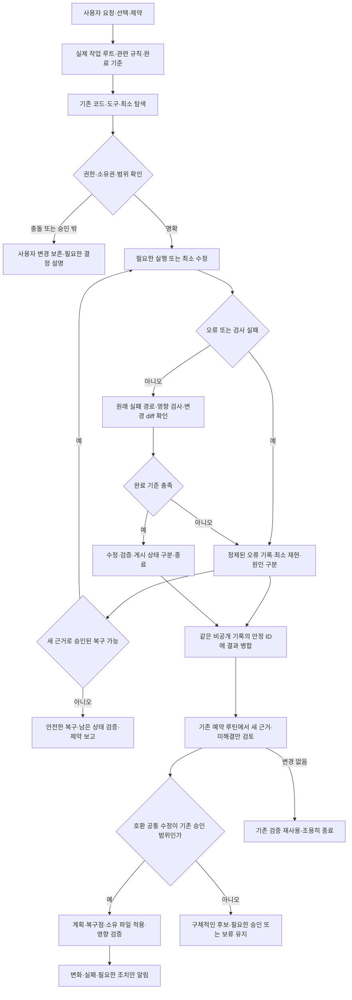

# 글로벌 셋업 인수인계 — 2026-10-08

이 문서는 `codex/global-setup-handoff-20261008` 브랜치에 정리한 변경의 목적,
구성, 운영 방식과 다른 PC의 검증 절차를 설명한다. 기반은 v1.2.4의 커밋
`c29724022221f0d8fe996da926fe12093c0a48a2`다. 브랜치 게시와 PR은 릴리스 배포,
다른 PC 설치 또는 해당 PC에서의 실제 UI 검증과 구분한다.

## 목표와 설계 이유

목표는 사용자의 의도·제약·완료 기준을 파악하고 필요한 탐색·도구·수정·검증으로
업무를 끝내는 것이다. 지침의 양이나 도구 호출 수를 늘리는 것이 목표는 아니다.
RTK 추정치와 압축 바이트를 실제 OpenAI 사용량으로 오해하지 않는다.

| 선택 | 이유 | 적용 위치 |
|---|---|---|
| 짧은 글로벌 작업 규칙 | 모든 작업에 공통인 선호·보존·완료 기준만 상시 제공 | `global/AGENTS.md` |
| 필요한 가이드만 읽기 | 단순 작업에 설정·Git·오류 절차 전체를 강제로 싣지 않음 | `global/guides/` |
| 소유권 기반 설치 | 기존 사용자 파일·인증·프로젝트 소스를 덮어쓰지 않고 충돌 확인 | `scripts/setup.py`, `manifest.json` |
| 명시적 RTK 러너 | 소유권·해시·종료 코드를 확인하며 지원되는 진단 출력만 축약 | `global/runtime/rtk_runner.py`, `scripts/tools.py` |
| 개인 Computer Use 스킬 | 여러 프로젝트에서 같은 도구 선택·관찰·복구 절차 재사용 | `global/skills/computer-use-workflow/` |
| Ponytail·Archify 명시 호출 | 사용자 요청과 무관한 설계·렌더링·컨텍스트 확대 방지 | 고정된 원본 패키지와 호출 정책 |
| 정기 확인 + 작업 중 오류 대응 | 버전 수집은 기존 일정, 차단 문제는 해당 작업에서 바로 해결 | 공통 유지관리 템플릿·조건부 가이드 |
| 하나의 비공개 개선 기록 | 선호·가설·오류·검증을 중복 저장하지 않고 근거로 연결 | 각 호스트의 `routine-review.json` |
| 보고서와 근거 분리 | 읽기 쉬운 차트·배지와 정확한 검증 범위·미확인 상태를 함께 제공 | `templates/reports/` |

TRACE는 개인 구성이다. RTK·Ponytail·Archify는 제3자 도구이며 Computer Use
워크플로 스킬도 TRACE가 작성했다. OpenAI 공식 문서를 근거로 삼았다는 것이
OpenAI가 이 셋업을 인증했거나 추가 실행 권한을 부여했다는 뜻은 아니다.
현재 사용자가 선택한 모델·effort를 보존하며 다른 모델의 블로그 사례를 성능 보장으로
사용하지 않는다. 자아·모델 재학습·모든 세션의 완전한 기억을 구현한 것이 아니다.

## 이번 브랜치에 포함한 내용

1. 글로벌 합의의 의도 파악, 필요한 탐색, 기존 검증 재사용, 오류 대응 라우팅 정리.
2. 기존 공식 근거 가이드에 프로젝트 작업 오류의 기록·재현·원인·수정·검증 절차 추가.
3. 개인 Computer Use 스킬의 세 파일을 기존 소유권 설치 대상으로 추가.
4. 내장 브라우저·Chrome·Windows 앱의 경로 선택, 실제 관찰과 실행 증거 분리,
   오래된 탭·잘못된 창·정책 차단·실행 실패의 제한된 복구 절차.
5. 공식 Computer Use·브라우저·확장 원문을 근거 목록에 추가하고 관련 기존 근거 검토 갱신.
6. 검토한 Codex CLI 기준을 0.161.0으로 갱신. 설치 버전과 공개 릴리스는 별도 기록.
7. 유지관리 템플릿에 도구·오류·브라우저별 검증과 프로젝트 오류 검토 계약 반영.
8. 스킬 개수를 하드코딩하지 않고 manifest에서 계산하는 저장소 검증 보완.
9. 검증 결과·장애 사례·다른 PC 절차·로컬 보고서 UI 템플릿과 폰트 라이선스 정리.
10. 지원 진단마다 명시 RTK 사용, 활성 프로젝트 도구 라우팅, 확인된 선호·오류의 일일 회고와 최종 공유 루틴.
11. 선택적 RTK 실시간 화면: 읽기 전용 루프백 서버·Windows 런처·자동 갱신·오류/숨김/일시정지 상태와 검사.

설치 로직에 새 프로젝트 감시 서비스나 자동 수정 실행기를 추가하지 않았다.
기존 `setup.py`가 스킬까지 동일한 manifest와 복구 절차로 설치한다.
실시간 보고 서버는 별도 사용자 실행 기능이며 `setup.py`나 자동화가 자동 설치·시작하지 않는다.
전체 설명은 [루틴·RTK FLOW](codex-routine-share.md),
실행법은 [실시간 화면](rtk-live-dashboard.md)을 따른다.

## 전체 작업 흐름



이 흐름은 논리·운영 계약이다. 실제 모든 모델 행동을 추적하거나 보장하는 도식은 아니다.
성공뿐 아니라 변경 없음, 범위 밖, 사용자 변경 충돌, 검사 실패, 복구 불가와 종료를 다룬다.
저장소의 `diagrams/global/` 및 이전 Archify 산출물은 각각의 검증 시점·호스트 문맥을
가진다. 기존 영수증이 있는 도식을 현재 PC의 새 일정으로 임의 덮어쓰지 않는다.

## 호스트별 일정과 권한

| 구분 | 2026-10-08 현재 Windows 호스트의 확인된 운영 | 다른 PC의 의미 |
|---|---|---|
| 글로벌 점검 | 기존 `codex` 자동화, 매일 08:00 Asia/Seoul, 같은 스레드·조용한 알림 | 설치만으로 생성·이전되지 않음 |
| 호환 변경 | 승인된 작은 글로벌 지침 보완·안정 CLI/RTK 업데이트 | 새 호스트는 review-only; 사람의 승인 필요 |
| 작업 중 오류 | Projects·Documents/ChatGPT의 승인된 활성 작업에서 관찰한 오류 대응 | 폴더명은 전체 스캔·자동 수정·등록 권한이 아님 |
| 의존성 정리 | 별도 기존 주간 루틴, 7일 미작업 기준, 네 종류 보호 | 사용자별 승인·보호 목록·일정을 따로 유지 |
| 공개 게시 | 이번 요청에서 새 브랜치와 PR 게시 승인 | 이후 모든 업데이트의 자동 게시 승인 아님 |

보호 종류는 나인원랩스·아크릴·파트너잇·놀씨어터다. 구체적인 경로·관련 이름은
이 호스트의 비공개 자동화가 정본이다. 저장소의 선택적 등록 프로젝트 45일 정책은
이 주간 7일 정책을 대체하지 않는다. 다른 릴리스 문서의 월요일 10:00 루틴은
다른 호스트의 과거 운영 기록이며 현재 호스트 일정의 근거로 사용하지 않는다.
PC와 앱이 실행 불가한 기간에는 성공을 기록하지 않는다.

## 오류를 어떻게 다루는가

오류마다 안정 ID, 정제된 서명, 작업/표면·단계, 도구 식별자, 최초·최근 확인,
확인된 원인과 가설, 영향, 복구 결과, 원래 경로 검증, 다음 조치를 남긴다.
반복 오류는 병합하고 원인 불명은 유지한다. 기록 실패 자체도 미확인 공백으로 알린다.

단순 검색 결과 없음·의도한 실패 테스트는 제품 오류가 아니다. 잘못된 경로 등 에이전트
절차의 실패는 프로젝트 버그와 구분해 기록한다. 예상 밖 실패와 틀린 결과는 해당
승인된 작업 중 바로 진단하며 다음 예약 실행까지 미루지 않는다. 프로젝트 고유 수정은
활성 작업 권한 안에서 수행하고, 일일 글로벌 점검이 임의로 비활성 소스를 수정하지 않는다.

현재 방식은 지침 기반이다. 공식 `PostToolUse` 훅은 지원되는 로컬 도구 출력과
일부 비정상 종료를 관찰하지만 hosted/specialized 경로·클라우드 orchestration에는
제한이 있다. 도구 밖에서 발생한 모든 오류의 자동 포착을 보장하지 않는다.
구체적인 누락이 확인될 때 해당 클라이언트의 커버리지·정제·신뢰·실패·복구를 검증한
좁은 훅을 검토한다. 수집을 위해 권한이나 승인 결정을 바꾸지 않는다.

원문 출력·소스·고객 자료·스크린샷·명령 인자·프롬프트·비밀·전체 대화는 공유 기록에
복제하지 않는다. 프로젝트 고유 규칙은 프로젝트에, 확인된 공통 원인만 조건부 가이드에
반영한다. 자세한 절차는 [오류 가이드](../global/guides/official-source-workflow.md#errors-encountered-during-project-work)에 있다.

## RTK·Ponytail·Archify·Computer Use 역할

| 도구 | 언제·어떻게 사용 | 완료 증거와 한계 |
|---|---|---|
| RTK | 지원되고 긴 진단 출력을 명시적 검증 러너로 실행 | 출력·종료 코드·필요 증거 비교; 최종 acceptance는 native 출력 |
| Ponytail | 명시 요청 시 문제 이해 → 기존 도구 → 표준 기능 → 최소 구현 | 요청 기능·보안·오류 처리·검증 유지; 호출 정책 검사와 실제 행동 구분 |
| Archify | 명시 요청한 도식에 코드·운영의 성공/실패/충돌/종료 경로를 대조 | 도식·파일 검증과 실제 실행 증거 구분 |
| 개인 UI 스킬 | UI 작업 또는 해당 실패 시 공식 런타임을 선택·관찰·복구 | 내장 브라우저·Chrome·Windows 각각의 실제 성공·제약을 기록 |

RTK는 명령 → 소유권/해시 확인 → 지원 필터 → 축약 결과/종료 코드 → 로컬 집계 →
일별 보고 순서다. 집계는 같은 날짜 재실행 시 스냅샷을 교체하고 누락일은 미수집으로
남긴다. RTK의 기록 날짜와 KST 수집 날짜를 별도로 유지한다. 누적 기록에 이전 버전과
검증 호출이 섞여 있음을 표시하며 산술 차이는 원인을 밝히기 전 미확인이다.
$200 구독 절감률·남은 사용량·업무 시간으로 환산하지 않는다.

전체 명령마다 업데이트하거나 일일 합성 UI 실험으로 사용자의 화면을 점유하지 않는다.
새 버전·필터·관련 오류가 바뀌었을 때 영향받은 경로만 다시 검증한다.

## 다른 PC에서 검증하기

처음 설치하는 Windows PC는 [상세 적용법](install-another-windows-pc.md)을 먼저 따른다.
의존성 설치·없는 작업 폴더 생성·프로젝트별 패키지·로그인·루틴 등록까지 단계별로 정리했다.

```text
git clone --branch codex/global-setup-handoff-20261008 https://github.com/DevCrop/codex-setup.git
cd codex-setup
git rev-parse HEAD
python --version
python -B -m unittest discover -s scripts -p 'test_*.py' -v
python -B scripts/validate_repo.py
python -B scripts/setup.py plan
python -B scripts/setup.py apply
python -B scripts/setup.py verify
python -B scripts/setup.py apply
python -B scripts/setup.py doctor
```

Windows PowerShell에서는 `$env:PYTHONIOENCODING = 'utf-8'`을 사용한다.
`plan` 충돌을 먼저 검토하고 기존 관리 파일의 사용자 변경을 덮어쓰지 않는다.
반복 적용은 `unchanged`여야 한다. 인증은 각 PC에서 별도로 한다.
기존 모델·effort·MCP·권한·훅·프로젝트 소스의 보존을 확인한다.

`CODEX_HOME`/`--home`은 Codex 홈을 선택하고 `--personal-skills`는 개인 스킬
루트를 선택한다. 두 루트는 독립적이다. 격리 테스트는 `--home`,
`--personal-skills`, `--state`를 모두 임시 위치로 지정하며 실제 홈 삭제로 시험하지 않는다.

새 세션에서 글로벌 규칙이 로딩되는지 확인한다. UI 작업을 테스트하려면
`$computer-use-workflow`를 명시하고 공식 도구가 실제 제공되는지 확인한다.
원하는 내장 브라우저/Chrome 또는 앱의 작은 승인된 조작을 각각 실행·검증한다.
개인 스킬 설치가 공식 플러그인·Chrome 확장·앱 접근 권한을 설치하지는 않는다.
파일/skills-list 성공만으로 데스크톱 호출이나 모델 준수를 증명하지 않는다.

별도 승인된 RTK 설치는 `scripts/tools.py install-rtk`, 검증은 `tools.py verify`다.
해당 PC에서 필요한 읽기 전용 명령을 원본/러너로 비교한다. 다른 PC의 바이너리·설치
영수증·실제 집계를 복사하지 않는다. 기존 자동화 프롬프트는
`scripts/render_heartbeat.py --automation-id EXISTING_ID`로 검토하며 렌더러 자체는
자동화를 등록하거나 승인하지 않는다.

보고 UI의 소스와 폰트는 [보고 템플릿](../templates/reports/README.md)에 있다.
실제 호스트 데이터로 안전하게 렌더링해야 하며 템플릿만 복사한 것은 보고 갱신 성공이 아니다.

## 실제 검증과 미검증 구분

[2026-10-08 검증 기록](verification-computer-use.md)에 버전·구조·격리 설치·실행 범위를
정리했다. Windows 계산기 입력/복구, 내장 브라우저 문서 링크/뒤로 가기,
Chrome 링크/뒤로·앞으로/화면 확인은 실제 실행했다. 이전 kernel-assets 증상은 이
경로에서 해소됐지만 원인은 미확인이다. 로컬 `file:` 페이지는 도구 정책에 막혀
새 화면 검증을 했다고 주장하지 않는다. 공개 원문 접근 실패는 성공한 공식 대체 접근과
구분했고, 잘못된 상대 경로의 실제 셋업 실패는 루트 경로 수정 후 검증·기록했다.

CLI 0.161.0·RTK 0.51.0·Node 22.23.3·npm 10.9.9·Corepack 0.36.0·tsx 4.23.15·
TypeScript 7.0.2는 이 호스트의 해당 날짜 확인값이다. 새 PC 전체에 버전을 강제하지 않는다.
새로운 사용자의 PC·모든 앱/사이트·향후 모델 행동은 아직 검증하지 않았다.
CI 결과는 PR의 최종 커밋별 실제 결과로 확인하며 이 문서가 미래 성공을 보장하지 않는다.

## 공유하지 않은 것

실제 호스트 집계·프로젝트 경로와 원시 이력·개인 incident·인증·대화·설치 상태·
백업·사용자 스크린샷·앱 프로필은 저장소에 넣지 않는다. 삭제했던 비활성 임시 파일과
npm 미사용 캐시는 [검증 요약](verification-computer-use.md)에만 정제된 범위/바이트로
기록하며 새로운 PC에서 동일 삭제를 재실행하라는 지시가 아니다.
새 브랜치·PR을 올리는 작업은 main 병합·새 태그·릴리스 ZIP 게시와 별개다.

공식 근거: [글로벌/프로젝트 지침](https://learn.chatgpt.com/docs/agent-configuration/agents-md),
[스킬](https://learn.chatgpt.com/docs/build-skills), [훅](https://learn.chatgpt.com/docs/hooks),
[Computer Use](https://learn.chatgpt.com/docs/computer-use),
[브라우저](https://learn.chatgpt.com/docs/browser), [Chrome 확장](https://learn.chatgpt.com/docs/chrome-extension).
근거 목록의 검토일·주장·파일을 확인하며 공식 기능과 개인 운영 정책을 분리한다.
